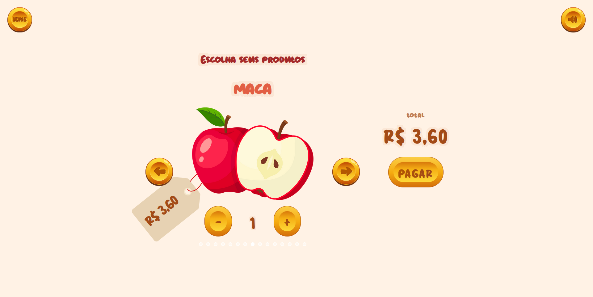
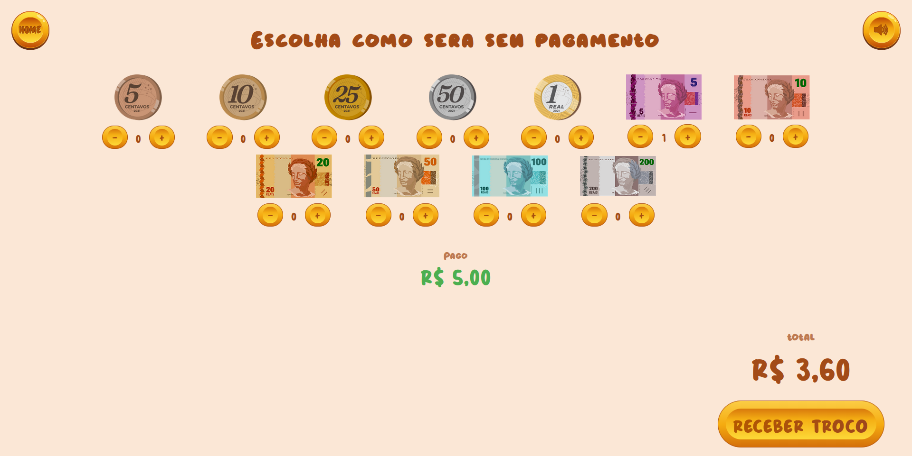
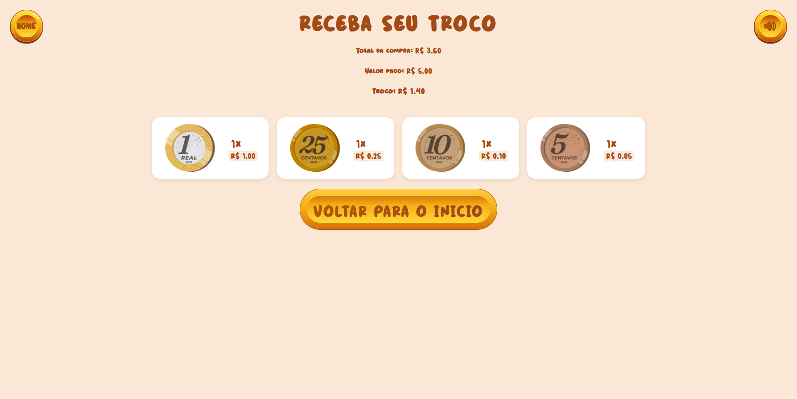

# G17_Greed_PA-26.1

## Sistema de caixa

Conteúdo da Disciplina: Greed

## Alunos
|Matrícula | Aluno |
| -- | -- |
| 23/1011515  | [Isaque Camargos Nascimento](https://github.com/isaqzin) |
| 23/1026750 | [Ludmila Aysha Oliveira Nunes](https://github.com/ludmilaaysha) |

## Sobre 

Projeto desenvolvido para a disciplina **Projeto de Algoritmos** da Universidade de Brasília (UnB), ministrada pelo professor Maurício Serrano, no semestre 2026.1.

Este trabalho faz parte do Módulo 2 da disciplina (**Greed**) e consiste na implementação do Algoritmo Coin Chaing/troco para encontrar o troco com o menor número de moedas e cédulas em um mercado imaginário.

Para demonstrar a implementação do algoritmo foi desenvolvido um site em django para exemplificar o uso.
### Como funciona o algoritmo?
  1. Ordena-se as cédulas/moedas disponíveis de forma decrescente
  2. Encontra a maior cédula/moeda disponível que é menor que o valor do troco
  3. Decrementa do valor do troco o valor da cédula/moeda
  4. Soma +1 na quantidade de vezes que usou a respectiva moeda/cédula
  5. Se o valor do troco é igual a zero retorne quantas vezes usou cada moeda/cédula, se não, retorne ao passo 2 
## Screenshots

## Instalação 
Linguagem: Python<br>
Framework: Django<br>

Nós desejávamos criar uma interface gráfica e julgamos ser mais fácil criar um site, por isso, escolhemos o django por já termos trabalhado anteriormente com este framework.

### Linux

#### Instale dependências

```bash
python3 -m venv .venv

# linux
source .venv/bin/activate

# win
.venv\Scripts\activate.bat

pip install -r requirements.txt
```

#### Compile o projeto e execute

```bash
cd caixa_supermercado
python manage.py migrate 
python manage.py runserver
```

## Uso 






## Vídeo de apresentação

<iframe width="560" height="315" src="https://www.youtube.com/embed/D9nY_JG_CGw?si=hxvvsMS8qLl2Gcrt" title="YouTube video player" frameborder="0" allow="accelerometer; autoplay; clipboard-write; encrypted-media; gyroscope; picture-in-picture; web-share" referrerpolicy="strict-origin-when-cross-origin" allowfullscreen></iframe>

